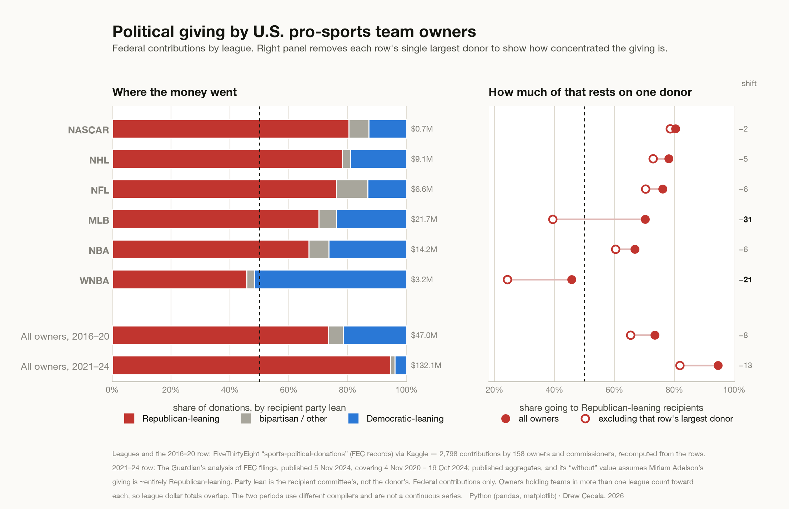

# Political giving by U.S. pro-sports team owners

Federal political contributions by the people who own American professional
sports teams — broken out by league, and tested against the question that
actually matters for a number like this: **how much of it comes down to one
person?**

Every figure from the 2016–20 period is recomputed from 2,798 raw FEC
contribution records at build time and printed to an audit table. Nothing here
is estimated; where a figure could not be verified it is labelled as
transcribed rather than computed.



## The finding

Sports-owner giving leans Republican — but the topline overstates how
*collective* that lean is. Removing a single donor moves it by 8 to 13 points,
and in one league by 31.

| League | All owners | Excl. largest donor | Shift | Largest donor (share of league) |
|---|---|---|---|---|
| NASCAR | 80.3% R | 78.5% | −1.8 | Roger Penske (58%) |
| NHL | 78.1% R | 72.8% | −5.3 | Philip F. Anschutz (20%) |
| NFL | 76.1% R | 70.3% | −5.8 | Jimmy and Susan Haslam (26%) |
| **MLB** | **70.2% R** | **39.3%** | **−30.9** | Charles Johnson (51%) |
| NBA | 66.8% R | 60.4% | −6.4 | Dan DeVos (16%) |
| **WNBA** | **45.7% R** | **24.2%** | **−21.5** | Kelly Loeffler (28%) |
| All owners, 2016–20 | 73.5% R | 65.3% | −8.1 | Charles Johnson (23%) |
| All owners, 2021–24 | 94.5% R | 81.7% | −12.8 | Miriam Adelson (70%) |

Three things fall out of that table:

- **MLB is not really a league-wide lean.** Charles Johnson (San Francisco
  Giants) supplies just over half of all MLB owner money by himself, 100% of it
  to Republican-leaning recipients. Take him out and the league crosses the
  midline to 39%.
- **The WNBA is the only league whose owners gave more to Democratic-leaning
  recipients** — and it is *more* so than it first appears. Kelly Loeffler
  alone is 28% of WNBA owner money; without her the league is 24% R / 72% D.
- **In 2021–24, one person is 70% of the entire dataset.** Miriam Adelson gave
  $92.3M — 2.3× more than every other U.S. team owner combined.

## Charts

| | |
|---|---|
| [`sports_owners_donations_chart.png`](output/sports_owners_donations_chart.png) | Two-panel figure on shared row axes: party composition, and the one-donor effect as a connected-dot plot |
| [`sports_owners_donations_reddit.png`](output/sports_owners_donations_reddit.png) | 1200×1600 portrait cut for mobile reading |
| [`sports_owners_donation_concentration.png`](output/sports_owners_donation_concentration.png) | Lorenz-style concentration curve plus the megadonor comparison |
| [`sports_owners_political_donations.png`](output/sports_owners_political_donations.png) | The original graphic — league diverging bars and the twelve largest individual donors |

## Sources

Two sources, kept separate because they are not the same kind of evidence.

**2016 / 2018 / 2020 cycles — row-level, recomputed.** FiveThirtyEight's
`sports-political-donations` dataset, compiled from Federal Election Commission
records, via the [Kaggle mirror](https://www.kaggle.com/datasets/rahul253801/political-donations-by-american-sports-owners).
2,798 contributions by 158 owners and commissioners across MLB, NBA, NFL, NHL,
WNBA and NASCAR. Every figure recomputed from the rows at build time.

**4 Nov 2020 – 16 Oct 2024 — published aggregates, transcribed.** The
Guardian's analysis of FEC filings, published 5 Nov 2024. No row-level file is
published, so those figures are transcribed constants and are labelled as such
on the chart. The Guardian notes its own totals are *"presumed to be a fraction
of the actual contributions."*

The two periods use different compilers, party-lean rules and league sets, so
they are shown as separate snapshots — **not** a continuous time series.

Full detail, including the arm's-length treatment of each source and all stated
limitations, is in [`docs/METHODOLOGY.md`](docs/METHODOLOGY.md).

## Reproducing

```bash
pip install -r requirements.txt
python scripts/build_chart.py
```

The dataset is pulled programmatically via `kagglehub` (no manual download),
and each script prints a full audit table of every number it draws before
writing the figure. The other three charts build the same way:

```bash
python scripts/build_reddit.py            # portrait / mobile cut
python scripts/build_concentration.py     # concentration curve
python scripts/build_leagues_and_owners.py
```

## Method notes

- **Party lean is the recipient committee's classification, not the donor's.**
  A contribution is categorised by who received it.
- **Federal contributions only** — no state or local giving, and no
  undisclosed spending. Dark-money channels are by definition absent.
- **Owners holding teams in more than one league count toward each**, so league
  dollar totals overlap and do not sum to the $47M total. Within-league
  percentages are unaffected.
- **"Without Adelson" assumes her giving is ~entirely Republican-leaning** —
  consistent with the reporting, but an assumption rather than a computed
  split, and disclosed on the chart.
- Colour palette validated in OKLab for colour-vision deficiency: the red/blue
  pair that carries the meaning clears the separation floor (worst-case
  ΔE 10.9 deutan, 11.5 tritan) and all three colours clear 3:1 contrast.

## Tools

Python 3 · pandas · matplotlib · kagglehub

## Licence

Code is MIT (see [`LICENSE`](LICENSE)). The charts are CC BY 4.0 — reuse them
with attribution. The underlying FEC records are public domain; the
FiveThirtyEight and Guardian compilations belong to their respective authors
and are cited rather than redistributed here.
